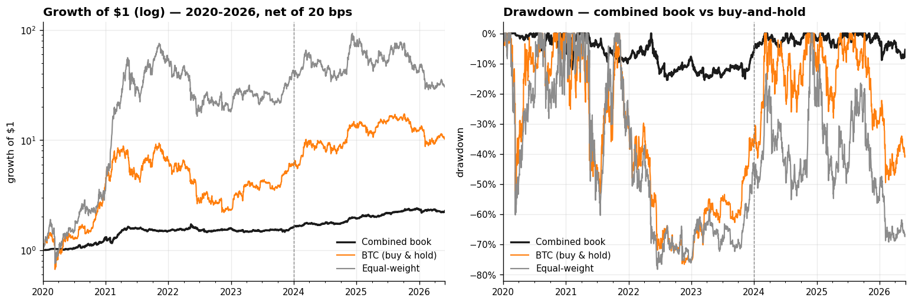
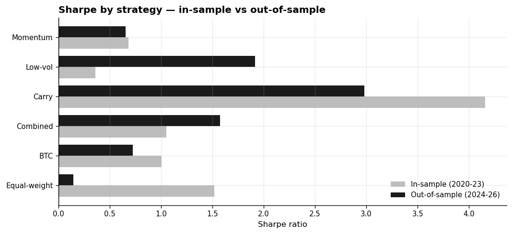

# Crypto Statistical Arbitrage

A market-neutral crypto book built from three uncorrelated edges — **momentum**, **low-volatility**, and
**funding carry** — and the full, honest search behind it. Designed on 2020–2023, tested out-of-sample on
2024–2026, net of a 20 bps turnover cost, with shorts restricted to coins that have a tradeable perpetual.

**Out-of-sample the combined book earns a Sharpe of +1.6 at a −15% maximum drawdown — versus roughly −77%
for buy-and-hold BTC — while beating both benchmarks on risk-adjusted return.**



## The result

Net of 20 bps on turnover, annualised √365. *Train* is in-sample (2020–2023); *Val* is out-of-sample
(2024–2026, never used for any design choice). *DSR* is the Deflated Sharpe (probability the true Sharpe > 0
after discounting for ~140 configurations searched).

| Strategy | Train | **Val (OOS)** | Val Sortino | Val Ann. Ret | Max DD | DSR |
|---|---:|---:|---:|---:|---:|---:|
| **Combined book** | +1.05 | **+1.57** | +2.21 | +14.6% | **−15%** | 0.42 |
| Momentum (proximity-to-high) | +0.68 | +0.65 | +0.87 | +14.2% | −49% | 0.05 |
| Low-volatility (idiosyncratic) | +0.36 | +1.92 | +2.75 | +45.7% | −60% | 0.63 |
| Carry (funding, daily marks) | +4.16 | +2.98 | +7.60 | +2.9% | −6% | 0.99 |
| BTC (benchmark) | +1.00 | +0.72 | +1.09 | +34.8% | −77% | 0.06 |
| Equal-weight (benchmark) | +1.52 | +0.15 | +0.21 | +9.6% | −78% | 0.01 |



The three sleeves are near-uncorrelated with each other and have β ≈ 0 to BTC, so the combined book
(inverse-volatility weighted, carry capped at 50%) is far steadier than any single sleeve. It is positive in
six of seven years and still clears +1.3 out-of-sample under a liquidity-aware square-root market-impact
cost. Carry shows the highest *daily* Sharpe, but that number rides on a volatility daily marks understate
roughly threefold; on honestly-measured (intraday-basis-inclusive) risk it is under +1, which is why the
book leads with the blend rather than carry alone.

## What's in this repo

Read it in this order:

1. **[`README.md`](README.md)** — you are here: the result.
2. **[`notebooks/01_combined_book.ipynb`](notebooks/01_combined_book.ipynb)** — the deliverable. How the
   book is built, each sleeve examined (what the signal is, whether it survives realistic frictions, where
   its return comes from), and a full robustness battery: per-year and per-regime breakdowns, deflated
   Sharpe, bootstrap intervals, cost sensitivity, capacity, and data-integrity checks.
3. **[`notebooks/02_signal_research.ipynb`](notebooks/02_signal_research.ipynb)** — the search behind the
   book. Every rejected idea (directional trend, cross-sectional and long-horizon momentum, short-horizon
   and idiosyncratic reversal, 4-hour intraday, order-flow, lottery/skew, Amihud illiquidity, funding-as-
   signal, seasonality, composites, cointegration pairs) coded from scratch and run with the *same* engine
   and costs, each failing one of four nameable traps.
3. **[`notebooks/03_walkforward.ipynb`](notebooks/03_walkforward.ipynb)** — an anchored walk-forward that
   re-fits the sleeve weights each quarter on past-only data and concatenates the out-of-sample pieces into
   one continuous 2021–2026 track. It reproduces the fixed-split result without ever setting a weight from a
   future return, answering the "you only saw one holdout" objection.
4. **[`qsa/`](qsa/)** — the toolkit the notebooks import, so they read as research, not plumbing:
   - `data.py` — self-contained downloader + point-in-time `Dataset`
   - `engine.py` — backtest, dollar-neutral construction, liquidity/short screens, metrics stack
   - `signals.py` — every signal formula (survivors and rejects) in one place
   - `plotting.py`, `config.py` — house style and the evaluation windows

## Running it

```bash
pip install -e .          # numpy / pandas / pyarrow / scipy / statsmodels / matplotlib
jupyter lab               # open notebooks/01_combined_book.ipynb and run top to bottom
```

**No data setup, no API keys.** On first run the notebooks download ~6 years of daily history (spot OHLCV,
perpetual closes, funding) straight from Binance's public archive (`data.binance.vision`) and cache it under
`crypto_data/` (~25 MB, gitignored); the first run takes ~5–8 minutes, every run after that loads from cache
in seconds.

The universe is **point-in-time / survivorship-bias-free**: 379 coins that were liquid at some point in
2020–2026, *including 155 since delisted or dead* (LUNA, FTT, SRM, …). The trading universe is the top-15 by
training-window dollar volume; the short leg is restricted to the 277 of those coins that have a tradeable
USDT perpetual.

## Method, in one paragraph

Every candidate is judged the same way: design on Train, read Validation as out-of-sample, keep only what is
positive in *both* windows, charge 20 bps on turnover, and require near-zero market beta. Returns use
`pct_change(fill_method=None)` (no forward-filled stale prices); positions lag one bar; the engine self-tests
for look-ahead. The full picture — full-period and per-year Sharpe — is reported alongside every split, so no
single window decides the verdict.

## Honest caveats

Stated in full in Appendix B of notebook 01. In short: all three sleeves are long-short and require shorting
via perpetuals; the sample is a single ~6-year crypto cycle (bootstrap intervals are wide, momentum's
deflated Sharpe is modest); low-vol's out-of-sample strength is regime-timed to deleveraging episodes;
carry's worst risk is sub-hourly and only partly captured; capacity is small-fund scale; and the validation
window, while never used for selection, has been inspected across iterations, so it is out-of-sample but not
a pristine lockbox.
