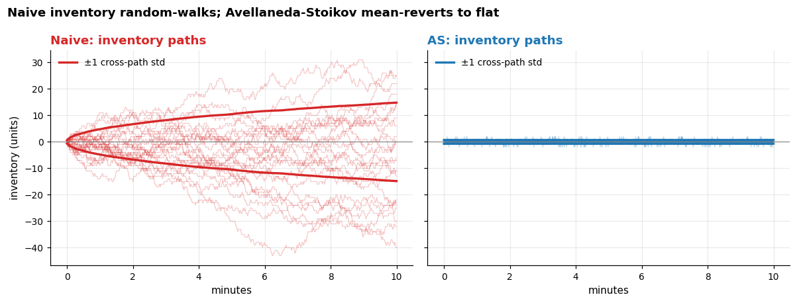
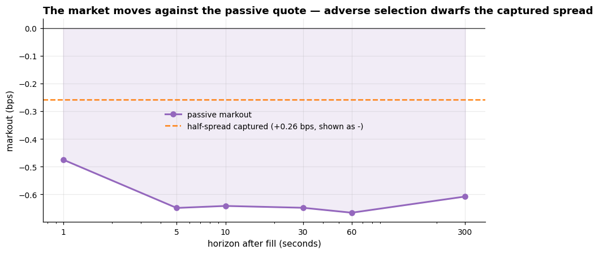

# A Market-Making Laboratory

[](https://github.com/Ponundrum/Jeevaa-Projects/actions/workflows/ci.yml)

A market maker who quotes symmetrically around the mid *thinks* they earn the spread. This
project builds a minimal simulator to state that intuition precisely, then measures — from
real Binance trades — the **adverse selection** that breaks it: the market moves against
essentially every passive fill. Once that measured adverse selection is fed back into the
simulator, naive spread-capture stops being profitable, and **inventory-aware
(Avellaneda–Stoikov) quoting is what survives**.

Everything is built from fewer than five moving parts that can be drawn on a whiteboard —
no reinforcement learning, no order-book reconstruction, no queue model. Where a closed
form exists (the AS quoting rule, the `γ → 0` limit, the PnL accounting identity), the code
is checked against it.

**On BTCUSDT trades, a passive fill captures ~0.26 bps of spread but is marked out by
~0.65 bps within a minute — adverse selection ≈ 2.5× the edge.** Fed back into the sim, that
drift turns a naive maker's PnL Sharpe from ~1.8 to ~0.5 (and negative at competitive quote
distances), while Avellaneda–Stoikov — holding almost no inventory — stays robust.



## The one idea, in three layers

Each layer is verifiable before the next is built (the self-test enforces it):

1. **The simulator** *(no data)* — an arithmetic-Brownian mid and a Poisson fill engine
   (`λ(δ) = A e^{-κδ}`), matched *exactly* to the Avellaneda–Stoikov assumptions so the
   closed-form quoting rule is ground truth against it.
2. **The strategies** — naive symmetric quoting (the strawman) vs Avellaneda–Stoikov, which
   quotes around an inventory-skewed reservation price. The head-to-head deliverable is a
   **PnL decomposition** into *spread PnL* and *inventory PnL* — the single most
   illuminating output, and the reason AS matters.
3. **Real data** — calibrate `σ, A, κ` from Binance `aggTrades`, measure the **markout
   curve** (the adverse selection), then **close the loop** by feeding it back into the sim
   and re-running both strategies.



## What's validated (the definition of done)

`self_test()` runs first in every notebook and as a unit test — seven checks, nothing
loosened to pass:

| Check | What it pins |
|---|---|
| 1. `γ → 0` limit | edge term `→ 2/κ`, reservation price `→` mid (analytic) |
| 2. Zero inventory | `q = 0` ⟹ reservation price `==` mid, exactly |
| 3. Accounting identity | `total PnL == spread PnL + inventory PnL` per path, to 1e-8 |
| 4. No fills | `A = 0` ⟹ zero fills, inventory, PnL |
| 5. Fill rate | measured fill rate matches `A e^{-κδ}` within MC error |
| 6. **Estimator recovery** | the `A`/`κ` calibration recovers known values from a synthetic tape |
| 7. AS beats naive on **inventory** | matched-parameter terminal-inventory std strictly lower for AS |

Check 7 pins the *inventory* claim, not a PnL claim — AS does **not** reliably beat naive on
mean PnL, and a test that asserted it would be a lie that eventually fails.

## What's in this repo

Read it in this order:

1. **[`notebooks/00_intuition.md`](notebooks/00_intuition.md)** — the whole project in plain
   language: the ten questions an interviewer asks (why symmetric quoting loses, what the
   reservation price is, why you can't backtest a market maker, …), answered without
   equations beyond the two AS formulas.
2. **[`notebooks/01_model_and_simulator.ipynb`](notebooks/01_model_and_simulator.ipynb)** —
   theory → simulator → strategy comparison → PnL decomposition → the inventory figure.
3. **[`notebooks/02_adverse_selection.ipynb`](notebooks/02_adverse_selection.ipynb)** —
   calibration on real BTCUSDT trades, the `κ` fit, the markout curve, and closing the loop.
4. **[`mmlab/`](mmlab/)** — the ~800-line package the notebooks import: `simulate.py`
   (mid + Poisson fills), `strategies.py` (naive, Avellaneda–Stoikov), `metrics.py` (PnL
   decomposition), `calibrate.py` (`σ, A, κ`), `markout.py`, `data.py` (cached Binance
   loader), `plotting.py`, `selftest.py`.

## Running it

```bash
pip install -e ".[dev]"      # numpy / scipy / pandas / matplotlib
python -c "from mmlab import self_test; self_test()"   # trust the lab first (~2s)
pytest                       # 26 unit tests, no network (~3s)
jupyter lab                  # notebooks/01 ... then notebooks/02
```

Every result is reproducible from the single seed in `mmlab/config.py` (`SEED = 20240101`).
Notebook 01 needs no data. Notebook 02 pulls a few days of BTCUSDT `aggTrades` from Binance's
public archive (`data.binance.vision`, ~15 MB/day) and caches them under `_cache/`; the
loader retries with backoff and degrades gracefully if the network is down.

## Honest limitations

- **Fills are a Poisson model, not a matching engine.** No queue position — in reality,
  being at the back of the queue means being filled precisely when you least want to be,
  which would make naive look *worse*, not better.
- **No latency, no cancellations, no order-size distribution** — every fill is one unit.
- **No market impact:** the simulated maker's own quotes do not move the price.
- **Arithmetic Brownian mid** has no fat tails, no volatility clustering, no jumps — the
  three things that actually kill market makers.
- **Mid proxy.** The futures `bookTicker` (true bid/ask) exists but is ~10× heavier
  (~188 MB/day), so notebook 02 uses a **trade-price mid proxy**. It is contaminated by
  bid–ask bounce (~one spread wide, mean-reverting), which damages the shortest-horizon (1s)
  markout most — visible in the curve, and why the headline leans on the 5–60s horizons.
- **The markout is measured on *all* tape trades**, not on this strategy's own fills, so it
  estimates the adverse selection facing a *typical* passive quote; and the feedback injects
  it as a first-order per-fill drift, not a microstructurally exact coupling.
- **The stationary variant is the pragmatic one.** The `(T−t)` clock is frozen at a fixed
  risk horizon (what production systems effectively do). The principled alternative is the
  Guéant–Lehalle–Fernandez-Tapia asymptotic solution, which gives stationary quotes and a
  hard inventory bound; it is *not* implemented here because its closed form was not sourced
  and verified, and writing it from memory would violate the project's "check against the
  math" rule.
- **One symbol, one window.** BTCUSDT, a few days in January 2024. No claim of generality —
  the point is to understand `κ`, not to survey coins.

MIT licensed. Sibling projects: **[`../crypto-stat-arb`](../crypto-stat-arb)** (empirical
crypto alpha research) and **[`../options-mc-engine`](../options-mc-engine)** (Monte Carlo
derivatives pricing).
