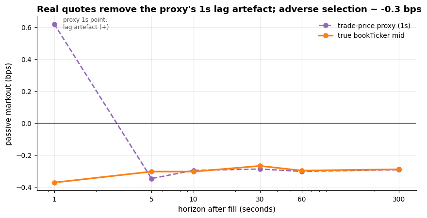

# A Market-Making Laboratory

[](https://github.com/Ponundrum/Jeevaa-Projects/actions/workflows/ci.yml)

A market maker who quotes symmetrically around the mid *thinks* they earn the spread. This
project builds a minimal simulator to state that intuition precisely, then measures — from
real Binance trades — the **adverse selection** it ignores: the market moves against the
passive side of essentially every fill. That measured adverse selection is then fed back
into the simulator to see what it does to naive vs inventory-aware (Avellaneda–Stoikov)
quoting.

Everything is built from fewer than five moving parts that can be drawn on a whiteboard —
no reinforcement learning, no order-book reconstruction, no queue model. Where a closed
form exists (the AS quoting rule, the `γ → 0` limit, the PnL accounting identity), the code
is checked against it.

**On BTCUSDT futures, a maker at the touch captures ~0.014 bps, is marked out ~0.30 bps, and
pays a 2 bps maker fee — and the fee is the dominant term that decides the sign.** Net per
fill is ~−2.3 bps at the standard tier, still negative at the free VIP-9 tier, and turns
positive only under a **negative** maker fee (exchange market-maker programmes pay ~−0.3 bps).
Market making here is not a spread business at retail fees at all — it exists because of the
rebate. Spread, markout, and fee are all measured (the spread from the real `bookTicker`
bid/ask, the fee from Binance's published schedule); Avellaneda–Stoikov's edge over naive is a
~13× smaller PnL variance — inventory control, not adverse-selection avoidance — and its faster
turnover actually costs it *more* once every fill is taxed.

> **The honest arc.** This headline took three tries, and the repo shows all three: (1) a
> *centred* mid proxy that peeked into the future gave a spurious "naive loses 2.5× the
> spread"; (2) a strictly *causal* proxy fixed the lookahead but couldn't resolve BTC's true
> spread, so it declined to quote the ratio at all; (3) real `bookTicker` quotes make the
> spread observable and the ratio defensible. Finding and owning each step — including a
> lookahead bug of my own — is the part worth reading. Notebook 02 is structured as
> *what the proxy got wrong, and by how much*.


## The one idea, in three layers

Each layer is verifiable before the next is built (the self-test enforces it):

1. **The simulator** *(no data)* — an arithmetic-Brownian mid and a Poisson fill engine
   (`λ(δ) = A e^{-κδ}`), matched *exactly* to the Avellaneda–Stoikov assumptions so the
   closed-form quoting rule is ground truth against it.
2. **The strategies** — naive symmetric quoting (the strawman) vs Avellaneda–Stoikov, which
   quotes around an inventory-skewed reservation price. The head-to-head deliverable is a
   **PnL decomposition** into *spread PnL* and *inventory PnL* — the single most
   illuminating output, and the reason AS matters.
3. **Real data** — calibrate `σ, A, κ` from Binance futures trades against the real
   `bookTicker` mid, measure the **touch half-spread** and the **markout curve** (the adverse
   selection), compare them to what a 1-second trade-price proxy would have said, then **close
   the loop** by feeding the measured drift back into the sim.



## What's validated (the definition of done)

`self_test()` runs first in every notebook and as a unit test — seven checks, nothing
loosened to pass:

| Check | What it pins |
|---|---|
| 1. `γ → 0` limit | edge term `→ 2/κ`, reservation price `→` mid (analytic) |
| 2. Zero inventory | `q = 0` ⟹ reservation price `==` mid, exactly |
| 3. Accounting identity | `total PnL == spread PnL + inventory PnL` per path, to 1e-8 |
| 4. No fills | `A = 0` ⟹ zero fills, inventory, PnL |
| 5. Fill rate | measured fill rate matches `A e^{-κδ}` within MC error |
| 6. **Estimator recovery** | the `A`/`κ` calibration recovers known values from a synthetic tape |
| 7. AS beats naive on **inventory** | matched-parameter terminal-inventory std strictly lower for AS |

Check 7 pins the *inventory* claim, not a PnL claim — AS does **not** reliably beat naive on
mean PnL, and a test that asserted it would be a lie that eventually fails.

## What's in this repo

Read it in this order:

1. **[`notebooks/00_intuition.md`](notebooks/00_intuition.md)** — the whole project in plain
   language: the ten questions an interviewer asks (why symmetric quoting loses, what the
   reservation price is, why you can't backtest a market maker, …), answered without
   equations beyond the two AS formulas.
2. **[`notebooks/01_model_and_simulator.ipynb`](notebooks/01_model_and_simulator.ipynb)** —
   theory → simulator → strategy comparison → PnL decomposition → the inventory figure.
3. **[`notebooks/02_adverse_selection.ipynb`](notebooks/02_adverse_selection.ipynb)** —
   real BTCUSDT futures quotes vs a trade-price proxy, side by side: the touch half-spread,
   the `σ`/`κ` recalibration, the markout comparison, the headline ratio, and closing the loop.
4. **[`mmlab/`](mmlab/)** — the package the notebooks import: `simulate.py` (mid + Poisson
   fills), `strategies.py` (naive, Avellaneda–Stoikov), `metrics.py` (PnL decomposition),
   `calibrate.py` (`σ, A, κ`), `markout.py`, `data.py` (spot `aggTrades` + the causal mid
   proxy), `quotes.py` (futures `bookTicker` + `aggTrades`, checksum + causal join),
   `plotting.py`, `selftest.py`.

## Running it

```bash
pip install -e ".[dev]"      # numpy / scipy / pandas / matplotlib
python -c "from mmlab import self_test; self_test()"   # trust the lab first (~2s)
pytest                       # 37 unit tests, no network (~3s)
jupyter lab                  # notebooks/01 ... then notebooks/02
```

Every result is reproducible from the single seed in `mmlab/config.py` (`SEED = 20240101`).
Notebook 01 needs no data. Notebook 02 pulls one day of BTCUSDT futures `aggTrades` (~13 MB)
and one day of `bookTicker` (~188 MB, checksum-verified) from Binance's public archive
(`data.binance.vision`), caching a compact derived parquet under `_cache/`; the loaders retry
with backoff and degrade gracefully offline.

## Honest limitations

- **Fills are a Poisson model, not a matching engine.** No queue position — in reality,
  being at the back of the queue means being filled precisely when you least want to be,
  which would make naive look *worse*, not better.
- **No latency, no cancellations, no order-size distribution** — every fill is one unit.
- **No market impact:** the simulated maker's own quotes do not move the price.
- **Arithmetic Brownian mid** has no fat tails, no volatility clustering, no jumps — the
  three things that actually kill market makers.
- **Real quotes now — but the trade proxy is kept as the comparison.** Notebook 02 uses the
  futures `bookTicker` (real bid/ask) for the headline, so the touch half-spread and fill
  elasticity are directly observed, not proxied. The 1-second trade-price proxy is retained
  *alongside* it to quantify its errors (it under-states `σ` by ~25%, under-states `κ` ~3×,
  and its 1-second markout is a sign-flipped lag artefact — while its 5–300s adverse-selection
  plateau matches the truth). Knowing which proxy estimate to distrust is the point.
- **Only the maker fee is modelled.** `simulate.run(fee_per_fill=…)` charges the Binance
  USDⓈ-M maker fee on every fill (and a negative value models a market-maker rebate), but
  funding payments and the *taker* fee on any hedging leg are not — a real book that offloads
  inventory aggressively would pay those too.
- **The markout is measured on *all* tape trades**, not on this strategy's own fills, so it
  estimates the adverse selection facing a *typical* passive quote; and the feedback injects
  it as a first-order per-fill drift whose *timing* is a modelling choice (the notebook reports
  a sensitivity over `adverse_steps`), not a microstructurally exact coupling.
- **AS quotes can cross the mid at high inventory.** The skew can push a half-spread negative,
  where `λ(δ) = A e^{−κδ}` is extrapolated outside `δ ≥ 0` and stops meaning anything (it does
  not bite at the inventories reached here, but `AvellanedaStoikov(min_half_spread=…)` floors
  it; a production maker would floor the quote and impose a hard inventory limit).
- **The stationary variant is the pragmatic one.** The `(T−t)` clock is frozen at a fixed
  risk horizon (what production systems effectively do). The principled alternative is the
  Guéant–Lehalle–Fernandez-Tapia asymptotic solution, which gives stationary quotes and a
  hard inventory bound; it is *not* implemented here because its closed form was not sourced
  and verified, and writing it from memory would violate the project's "check against the
  math" rule.
- **One symbol, one day.** BTCUSDT futures, 2024-01-15. No claim of generality —
  the point is to understand `κ`, not to survey coins.

MIT licensed. Sibling projects: **[`../crypto-stat-arb`](../crypto-stat-arb)** (empirical
crypto alpha research) and **[`../options-mc-engine`](../options-mc-engine)** (Monte Carlo
derivatives pricing).
