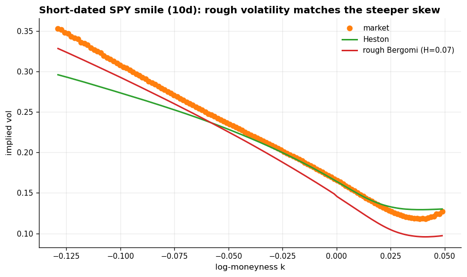
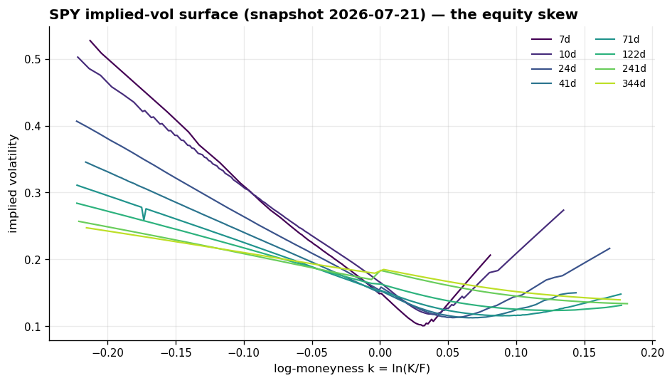
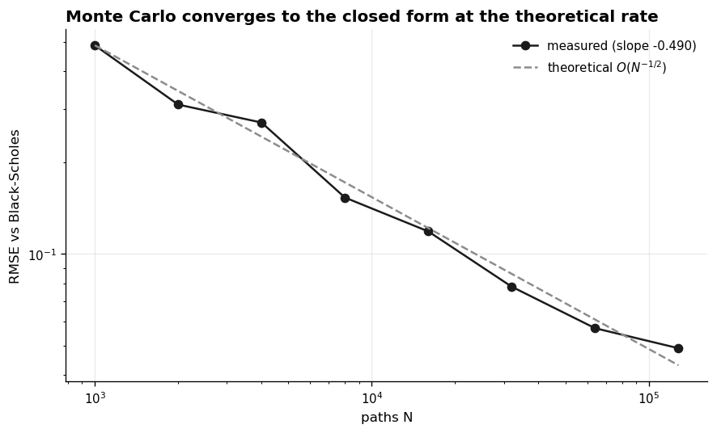

# Monte Carlo Derivatives Pricing & Rough-Volatility Engine

[](https://github.com/Ponundrum/Jeevaa-Projects/actions/workflows/ci.yml)

A from-scratch Monte Carlo option-pricing engine, **proven correct against closed-form Black–Scholes to within
Monte Carlo error**, then pushed into the models where no closed form exists: exotic path-dependent payoffs,
the Heston stochastic-volatility model, and **rough Bergomi**, whose variance is driven by a rough fractional
process simulated by covariance (Cholesky / Karhunen–Loève) decomposition.

**On a live SPY option-chain snapshot, rough volatility (calibrated Hurst H ≈ 0.07) matches the steep
short-dated skew that classical Heston structurally flattens** — the empirical "roughness" of volatility,
reproduced by an engine whose correctness was established first.



## What's validated (the definition of done)

Everything below is demonstrated in a notebook or a test — no tolerance was ever loosened to force a pass.

| Check | Result |
|---|---|
| European MC vs Black–Scholes (strike × maturity grid) | within **3 standard errors** everywhere (max 1.9) |
| Put–call parity on the engine's own prices | holds to MC error |
| Geometric-Asian MC vs its **closed form** (exact path-dependent check) | 1.2 SE apart |
| Barrier / lookback vs **continuous closed forms** (Reiner–Rubinstein, Goldman–Sosin–Gatto) | match under the **Broadie–Glasserman–Kou** discrete-monitoring correction |
| Variance reduction (control variate) | **7×** on the European, **1300×** on the arithmetic Asian |
| Convergence rate | measured log-log slope **−0.55** (theory −0.5) |
| Greeks (pathwise / likelihood-ratio / finite-difference) | all agree with analytic delta, vega, gamma |
| Digital delta — the discontinuous case | **likelihood-ratio matches** the closed form where pathwise is structurally zero |
| **Crank–Nicolson PDE** (a second, independent method) | European matches Black–Scholes to ~1e-3; prices the **American** early-exercise premium |
| Implied-vol inversion | round-trips a known vol to **1e-6** |
| SVI surface fit | butterfly-arbitrage-free; ~0.3 vol-pt slice RMSE |
| Heston calibration to SPY | **0.87 vol-point** IV RMSE (ρ = −0.71) |
| Rough Bergomi | simulated paths **recover H = 0.07**; matches the short-dated skew |

## What's in this repo

Read it in this order:

1. **[`notebooks/01_mc_engine_and_validation.ipynb`](notebooks/01_mc_engine_and_validation.ipynb)** — the
   engine, proven correct: European MC vs Black–Scholes, variance reduction, the `O(N^-1/2)` convergence rate,
   Monte Carlo Greeks by three methods, and exotics (with the geometric-Asian as an exact path-dependent check).
2. **[`notebooks/02_vol_surface_and_rough_vol.ipynb`](notebooks/02_vol_surface_and_rough_vol.ipynb)** — a real
   SPY implied-vol surface (below), an arbitrage-free SVI fit, a Heston calibration, and the rough-Bergomi
   payoff: verifiable roughness and the short-dated skew.

   
3. **[`qmc/`](qmc/)** — the toolkit the notebooks import (models implemented from scratch — no QuantLib):
   `analytic.py` (Black–Scholes, geometric-Asian, barrier, lookback, digital closed forms), `processes.py`
   (GBM, Heston QE, rough Bergomi), `payoffs.py`, `engine.py` (estimator + variance reduction + convergence +
   BGK correction), `greeks.py`, `pde.py` (Crank–Nicolson + American), `iv.py`, `calibration.py`, `data.py`,
   `selftest.py`.



## Running it

```bash
pip install -e ".[dev]"      # numpy / scipy / pandas / matplotlib / yfinance
python -c "from qmc import self_test; self_test()"   # trust the engine first (~1.3s)
pytest                       # 26 unit tests, no network (~3s)
jupyter lab                  # notebooks/01 ... then notebooks/02
```

Every result is reproducible from the single seed in `qmc/config.py` (`SEED = 20240101`). Notebook 01 needs
no data at all — it checks Monte Carlo against analytic formulas. Notebook 02 pulls **one** free option-chain
snapshot from Yahoo Finance and caches it under `_cache/` (offline thereafter); `qmc.data` handles network
failure gracefully.

## Honest limitations

- **Snapshot, not backtest.** Notebook 02 calibrates to one day's surface. It shows rough volatility *fits*
  better that day — not that it hedges better or that its calibration is stable over time (that needs a
  multi-day study this is not). Nothing here trades.
- **Compute.** The rough driver uses the exact `O(n^3)` Cholesky construction for transparency; production
  would use the Bennedsen–Lunde–Pakkanen hybrid scheme (`O(n log n)`) or a Fourier method.
- **Flat forward variance.** Rough Bergomi uses a scalar `xi0`, not a forward-variance *curve* `xi0(t)`
  bootstrapped from the ATM term structure — it matches the smile shape, not the ATM term structure by
  construction. And a calibrated Heston fit can land in Feller-violating territory (`2κθ < ξ²`); the QE scheme
  handles it, and the notebook reports the Feller ratio rather than passing over it.
- **Deep-OTM short-dated options** are hard for plain Monte Carlo (few paths reach them); the smile comparison
  is shown on the moneyness band where the estimator is reliable, and says so.
- **Calendar arbitrage:** the per-maturity SVI fit is butterfly-arbitrage-free, but independent slices can
  cross slightly off-ATM; a joint SSVI fit removes this by construction (both are in `qmc.iv`). Flagged, not
  hidden.

MIT licensed. Sibling project: **[`../crypto-stat-arb`](../crypto-stat-arb)** — empirical crypto alpha research.
